# ER Diagram — Behavioral Biometric Banking Platform

```mermaid
erDiagram
    %% ========================================================================
    %% CORE ENTITIES
    %% ========================================================================
    users {
        int id PK
        uuid uuid UK
        varchar email UK
        varchar password_hash
        varchar full_name
        varchar phone
        varchar role "customer | analyst | admin"
        boolean is_active
        boolean is_locked
        int failed_login_attempts
        timestamptz last_login_at
        inet last_login_ip
        varchar preferred_language
        boolean two_factor_enabled
        jsonb metadata
        timestamptz created_at
        timestamptz updated_at
    }

    accounts {
        int id PK
        uuid uuid UK
        int user_id FK
        varchar account_number UK
        varchar account_type "savings | current"
        varchar currency
        numeric balance
        numeric available_balance
        varchar status "active | dormant | closed | frozen"
        timestamptz opened_at
        timestamptz closed_at
        jsonb metadata
        timestamptz created_at
        timestamptz updated_at
    }

    cards {
        int id PK
        uuid uuid UK
        int account_id FK
        int user_id FK
        varchar card_type "credit | debit"
        varchar card_network
        varchar card_holder_name
        varchar masked_card_number
        varchar card_hash
        varchar last_four_digits
        date expiry_date
        varchar cvv_hash
        varchar status
        boolean is_frozen
        numeric daily_limit
        numeric transaction_limit
        numeric monthly_limit
        numeric daily_used
        numeric monthly_used
        boolean is_international_enabled
        boolean is_contactless_enabled
        boolean is_ecommerce_enabled
        int pin_attempts
        timestamptz issued_at
        timestamptz activated_at
        jsonb metadata
        timestamptz created_at
        timestamptz updated_at
    }

    beneficiaries {
        int id PK
        uuid uuid UK
        int user_id FK
        varchar beneficiary_name
        varchar beneficiary_account
        varchar beneficiary_bank
        varchar beneficiary_branch
        varchar ifsc_code
        varchar swift_code
        varchar nickname
        varchar relationship
        boolean is_active
        numeric max_limit
        numeric daily_limit
        boolean approval_required
        timestamptz added_at
        jsonb metadata
        timestamptz created_at
        timestamptz updated_at
    }

    loans {
        int id PK
        uuid uuid UK
        int account_id FK
        int user_id FK
        varchar loan_type "personal | home | auto | education | business"
        varchar loan_reference UK
        numeric principal_amount
        numeric interest_rate
        varchar interest_type "fixed | floating"
        int tenure_months
        numeric emi_amount
        numeric outstanding_amount
        numeric paid_amount
        varchar status "pending | active | closed | defaulted | foreclosed"
        timestamptz disbursed_at
        timestamptz closed_at
        date next_emi_date
        timestamptz last_emi_paid_at
        jsonb collateral_details
        jsonb metadata
        timestamptz created_at
        timestamptz updated_at
    }

    loan_emi_schedule {
        int id PK
        int loan_id FK
        int emi_number
        date due_date
        numeric amount
        numeric principal_component
        numeric interest_component
        numeric balance_after
        varchar status "pending | paid | overdue | defaulted"
        timestamptz paid_at
        numeric paid_amount
        int payment_transaction_id FK
        jsonb metadata
        timestamptz created_at
        timestamptz updated_at
    }

    device_fingerprints {
        int id PK
        uuid uuid UK
        int user_id FK
        varchar device_id
        varchar device_type
        varchar device_manufacturer
        varchar device_model
        varchar os
        varchar os_version
        varchar browser
        varchar browser_version
        varchar screen_resolution
        int color_depth
        varchar timezone
        varchar language
        text[] installed_fonts
        varchar webgl_fingerprint
        varchar canvas_fingerprint
        varchar audio_fingerprint
        int hardware_concurrency
        numeric device_memory
        boolean touch_support
        inet[] ip_addresses
        boolean is_trusted
        numeric trust_score
        timestamptz first_seen_at
        timestamptz last_seen_at
        jsonb metadata
        timestamptz created_at
        timestamptz updated_at
    }

    sessions {
        int id PK
        uuid uuid UK
        int user_id FK
        varchar session_token UK
        inet ip_address
        text user_agent
        int device_fingerprint_id FK
        boolean is_active
        boolean is_mfa_verified
        timestamptz mfa_verified_at
        timestamptz logged_in_at
        timestamptz logged_out_at
        timestamptz expires_at
        timestamptz last_activity_at
        jsonb metadata
        timestamptz created_at
        timestamptz updated_at
    }

    transactions {
        int id PK
        uuid uuid UK
        int account_id FK
        int card_id FK
        int session_id FK
        varchar transaction_type "transfer | payment | recharge | withdrawal | deposit | emi_payment"
        numeric amount
        numeric fee
        varchar currency
        varchar reference_number UK
        text description
        varchar status "pending | completed | failed | reversed | flagged"
        text failure_reason
        varchar counterparty_name
        varchar counterparty_account
        varchar counterparty_bank
        varchar category
        numeric latitude
        numeric longitude
        inet ip_address
        boolean is_international
        boolean is_flagged
        timestamptz processed_at
        timestamptz reversed_at
        jsonb metadata
        timestamptz created_at
        timestamptz updated_at
    }

    %% ========================================================================
    %% BEHAVIORAL & ML ENTITIES
    %% ========================================================================
    behavioral_events {
        int id PK
        uuid uuid UK
        int user_id FK
        int session_id FK
        varchar event_type
        varchar event_name
        jsonb event_data
        timestamptz client_timestamp
        timestamptz server_timestamp
        int time_diff_ms
        text page_url
        varchar element_selector
        varchar action
        varchar value_hash
        jsonb coordinates
        jsonb window_size
        jsonb metadata
        timestamptz created_at
    }

    behavioral_features {
        int id PK
        uuid uuid UK
        int user_id FK
        int session_id FK
        int source_event_group_id FK
        varchar feature_version
        varchar feature_set
        jsonb mouse_features
        jsonb keystroke_features
        jsonb touch_features
        jsonb navigation_features
        jsonb device_features
        jsonb temporal_features
        jsonb combined_vector
        int feature_dimension
        boolean is_outlier
        numeric outlier_score
        jsonb metadata
        timestamptz created_at
        timestamptz updated_at
    }

    behavioral_profiles {
        int id PK
        uuid uuid UK
        int user_id FK
        varchar profile_version
        varchar status "active | learning | stale | archived"
        numeric confidence_score
        int total_events_analyzed
        int total_sessions_analyzed
        jsonb mouse_pattern
        jsonb keystroke_pattern
        jsonb navigation_pattern
        jsonb touch_pattern
        jsonb temporal_pattern
        jsonb device_pattern
        jsonb behavioral_biometrics
        numeric baseline_deviation
        timestamptz last_calculated_at
        jsonb metadata
        timestamptz created_at
        timestamptz updated_at
    }

    ml_models {
        int id PK
        uuid uuid UK
        varchar model_name
        varchar model_version
        varchar model_type "anomaly_detection | classification | regression | clustering | feature_extractor"
        varchar algorithm
        bytea model_data
        jsonb model_metadata
        jsonb feature_importance
        jsonb performance_metrics
        jsonb training_data_range
        int training_samples
        numeric validation_score
        numeric test_score
        boolean is_active
        boolean is_production
        int trained_by FK
        timestamptz trained_at
        timestamptz deployed_at
        timestamptz retired_at
        jsonb metadata
        timestamptz created_at
        timestamptz updated_at
    }

    risk_scores {
        int id PK
        uuid uuid UK
        int user_id FK
        int transaction_id FK
        int session_id FK
        int model_id FK
        varchar score_type "transaction | session | login | transfer | behavioral | device | composite"
        numeric risk_score
        varchar risk_level "very_low | low | medium | high | critical"
        numeric confidence
        jsonb feature_contributions
        varchar model_version
        int execution_time_ms
        jsonb metadata
        timestamptz created_at
        timestamptz updated_at
    }

    fraud_alerts {
        int id PK
        uuid uuid UK
        int user_id FK
        int transaction_id FK
        int session_id FK
        int risk_score_id FK
        varchar alert_type
        varchar alert_severity "info | low | medium | high | critical"
        varchar status "open | investigating | resolved | false_positive | dismissed"
        varchar title
        text description
        text[] reason_codes
        numeric risk_score_value
        numeric threshold_value
        jsonb anomaly_details
        int assigned_to FK
        int resolved_by FK
        timestamptz resolved_at
        text resolution_notes
        jsonb metadata
        timestamptz created_at
        timestamptz updated_at
    }

    explainability_results {
        int id PK
        uuid uuid UK
        int user_id FK
        int fraud_alert_id FK
        int risk_score_id FK
        int transaction_id FK
        int session_id FK
        int model_id FK
        varchar explanation_type "shap | lime | feature_importance | rule_based | counterfactual | anchor"
        text[] reason_codes
        jsonb reason_descriptions
        jsonb top_features
        jsonb feature_contributions
        jsonb shap_values
        jsonb decision_path
        jsonb counterfactuals
        numeric confidence_score
        text human_readable_summary
        jsonb metadata
        timestamptz created_at
        timestamptz updated_at
    }

    model_drift_logs {
        int id PK
        uuid uuid UK
        int model_id FK
        varchar drift_type "concept_drift | data_drift | model_decay | feature_drift | prediction_drift"
        numeric drift_score
        varchar drift_severity "low | medium | high | critical"
        jsonb previous_metrics
        jsonb current_metrics
        text[] drifted_features
        jsonb feature_statistics
        int sample_count
        timestamptz window_start
        timestamptz window_end
        timestamptz detected_at
        varchar action_taken
        jsonb metadata
        timestamptz created_at
        timestamptz updated_at
    }

    retraining_queue {
        int id PK
        uuid uuid UK
        int model_id FK
        varchar model_name
        int priority
        varchar status "queued | in_progress | completed | failed | cancelled"
        varchar trigger_reason
        int trigger_event_id FK
        jsonb training_config
        int training_duration_ms
        jsonb result_metrics
        text error_message
        text error_traceback
        int triggered_by FK
        timestamptz started_at
        timestamptz completed_at
        jsonb metadata
        timestamptz created_at
        timestamptz updated_at
    }

    %% ========================================================================
    %% AUTH & AUDIT
    %% ========================================================================
    mfa_tokens {
        int id PK
        uuid uuid UK
        int user_id FK
        int session_id FK
        varchar token_type "totp | sms | email | push | backup_code"
        varchar token_code_hash
        boolean is_used
        boolean is_valid
        int attempts
        int max_attempts
        timestamptz expires_at
        timestamptz used_at
        timestamptz verified_at
        jsonb metadata
        timestamptz created_at
        timestamptz updated_at
    }

    refresh_tokens {
        int id PK
        uuid uuid UK
        int user_id FK
        varchar token_hash UK
        boolean is_revoked
        boolean is_used
        int device_fingerprint_id FK
        inet ip_address
        text user_agent
        timestamptz expires_at
        timestamptz revoked_at
        int replaced_by FK
        jsonb metadata
        timestamptz created_at
        timestamptz updated_at
    }

    audit_logs {
        int id PK
        uuid uuid UK
        int user_id FK
        int session_id FK
        varchar action
        varchar entity_type
        int entity_id
        uuid entity_uuid
        varchar action_type "CREATE | READ | UPDATE | DELETE | LOGIN | LOGOUT | EXPORT | OTHER"
        varchar severity "info | low | medium | high | critical"
        varchar status "success | failure | pending"
        jsonb old_values
        jsonb new_values
        jsonb changes
        inet ip_address
        text user_agent
        varchar request_id
        jsonb geo_location
        text failure_reason
        jsonb metadata
        timestamptz created_at
    }

    %% ========================================================================
    %% RELATIONSHIPS
    %% ========================================================================
    users ||--o{ accounts : "has"
    users ||--o{ cards : "owns"
    users ||--o{ beneficiaries : "manages"
    users ||--o{ loans : "borrows"
    users ||--o{ sessions : "creates"
    users ||--o{ behavioral_events : "generates"
    users ||--o{ behavioral_features : "has"
    users ||--o{ behavioral_profiles : "has profile"
    users ||--o{ risk_scores : "scored"
    users ||--o{ fraud_alerts : "triggers"
    users ||--o{ explainability_results : "explains"
    users ||--o{ mfa_tokens : "requests"
    users ||--o{ refresh_tokens : "holds"
    users ||--o{ audit_logs : "audited"
    users ||--o{ device_fingerprints : "fingerprinted"

    accounts ||--o{ transactions : "records"
    accounts ||--o{ cards : "linked to"
    accounts ||--o{ loans : "holds"

    cards ||--o{ transactions : "used in"

    loans ||--o{ loan_emi_schedule : "schedules"

    sessions ||--o{ behavioral_events : "captured in"
    sessions ||--o{ risk_scores : "evaluated in"
    sessions ||--o{ transactions : "initiated in"
    sessions ||--o{ fraud_alerts : "flagged in"

    device_fingerprints ||--o{ sessions : "associated with"
    device_fingerprints ||--o{ refresh_tokens : "linked to"

    transactions ||--o{ risk_scores : "scored by"
    transactions ||--o{ fraud_alerts : "flagged by"
    transactions ||--o{ explainability_results : "explained by"
    transactions ||--o{ loan_emi_schedule : "pays EMI"

    behavioral_events ||--o{ behavioral_features : "extracts"

    ml_models ||--o{ risk_scores : "produces"
    ml_models ||--o{ model_drift_logs : "monitored by"
    ml_models ||--o{ explainability_results : "interprets"
    ml_models ||--o{ retraining_queue : "queued for"
    ml_models ||--o{ fraud_alerts : "powers"

    risk_scores ||--o{ fraud_alerts : "generates"
    risk_scores ||--o{ explainability_results : "explains"

    fraud_alerts ||--o{ explainability_results : "explains"

    model_drift_logs ||--o{ retraining_queue : "triggers"
```

## Legend

| Symbol | Meaning |
|--------|---------|
| `||--o{` | One-to-many (parent to child) |
| `||--||` | One-to-one |
| `}o--o{` | Many-to-many |
| `PK` | Primary Key |
| `FK` | Foreign Key |
| `UK` | Unique Key |
