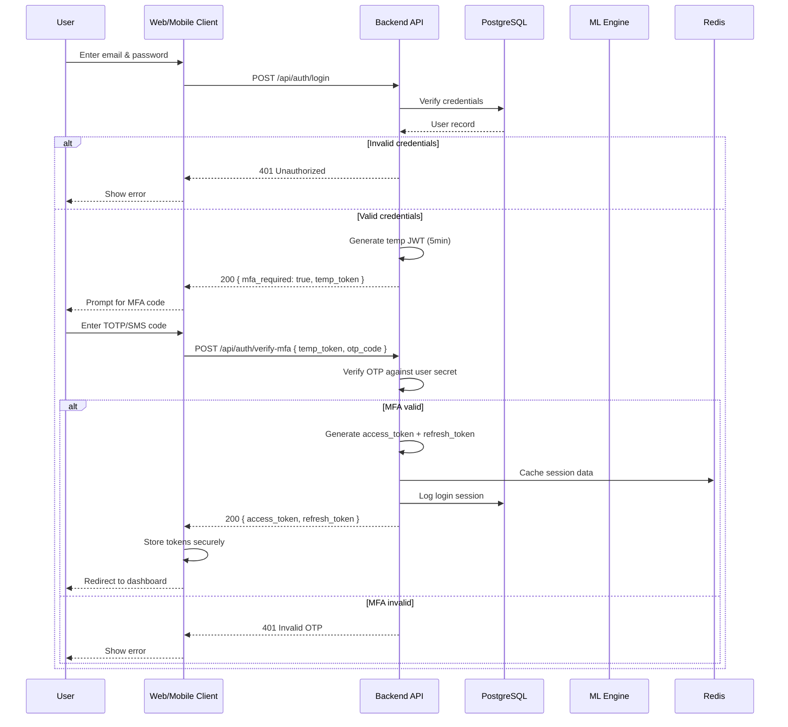
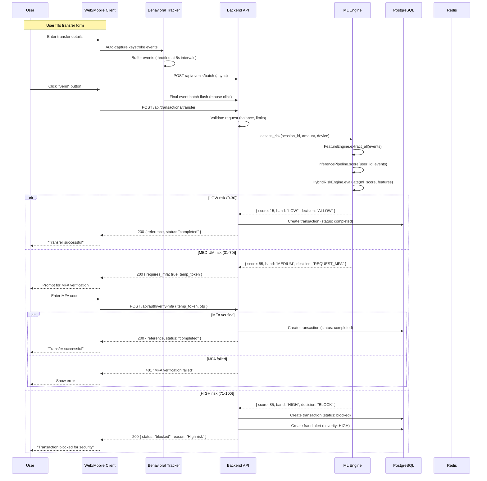
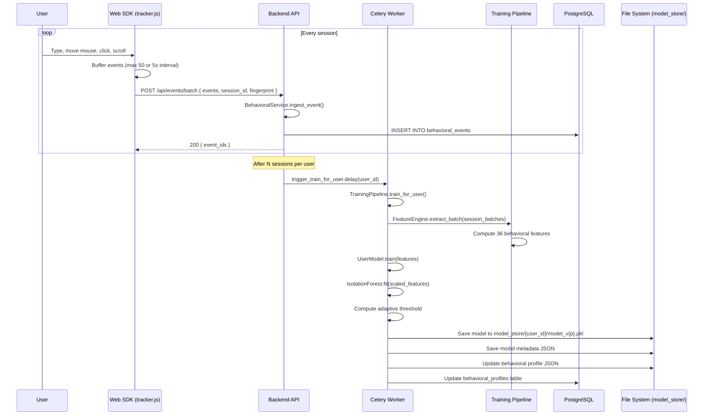
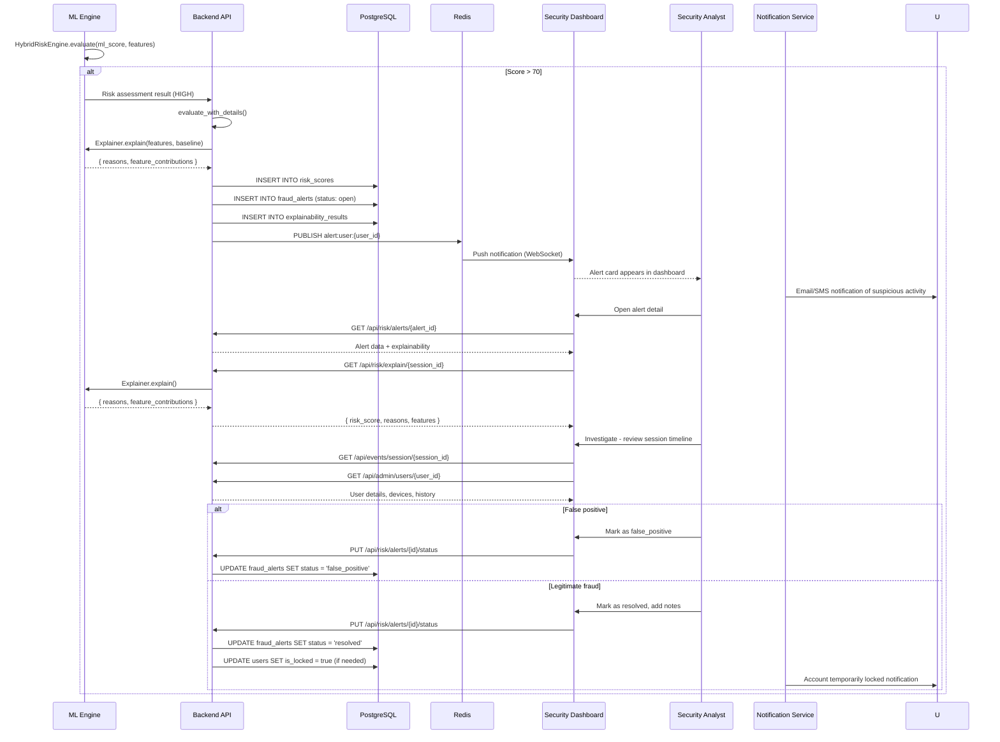
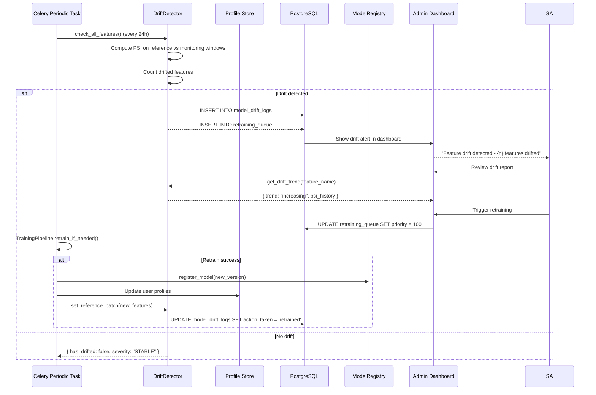

# Data Flow Diagrams

## 1. Authentication Flow (Login with MFA)

## 2. Transaction Flow with Behavioral Risk Assessment

## 3. Behavioral Event Capture & Training Pipeline

## 4. Fraud Alert Resolution Flow

## 5. ML Model Drift Detection Flow

## Data Flow Summary

| Flow | Trigger | Key Components | Average Latency |
|------|---------|----------------|-----------------|
| Authentication | User login attempt | AuthService, JWT, MFA | ~200ms (without MFA) |
| Transaction + Risk | Transfer submission | BankingService, RiskService, HybridRiskEngine | ~350ms |
| Event Ingestion | User interaction | BehavioralTracker, BehavioralService, FeatureEngine | ~50ms (batch) |
| Fraud Alert | Risk score > 70 | RiskService, Explainer, NotificationService | ~100ms |
| Model Training | Session threshold met | TrainingPipeline, UserModel, ModelRegistry | ~30s-2min |
| Drift Detection | Periodic (24h) | DriftDetector, PSI computation, ModelRegistry | ~5min |
